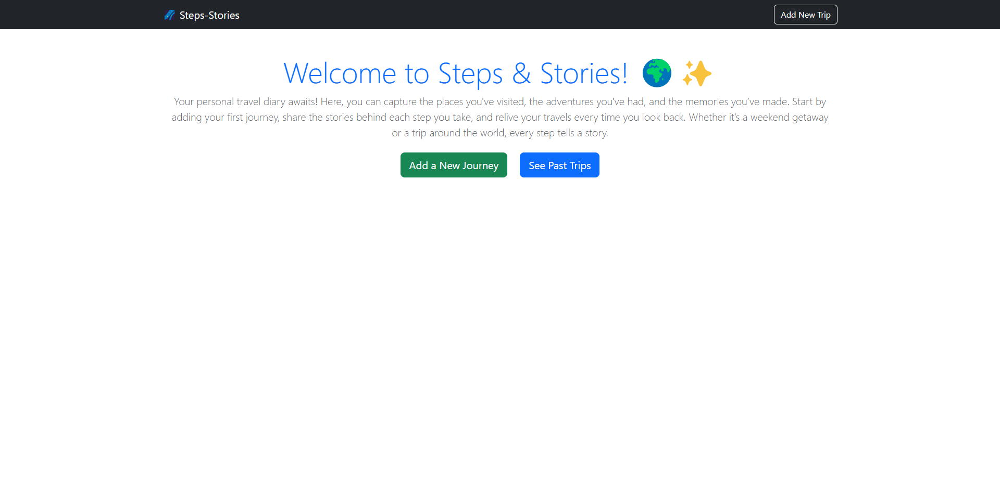

# 🌍 Steps & Stories

**Steps & Stories** is a personal travel diary web app where users can document their journeys, reflect on experiences, and organize memories with tags and images. Whether it's a weekend getaway or a globe-spanning adventure, every step tells a story.

 

## ✨ Features

- 📝 Add and edit travel posts with title, date, location, tags, story, and images
- 🗂 View past trips in a clean, card-based timeline
- 📦 File upload support for storing trip photos
- 💡 Simple UI with Bootstrap styling
- 🔁 Responsive design, works on mobile & desktop
- 🧭 Fully navigable experience with routing via Express

## 🚀 Live Demo

👉 [Try the live app here](https://steps-stories.onrender.com)


## ⚙️ Tech Stack

- **Frontend**: EJS, Bootstrap 5
- **Backend**: Node.js, Express.js
- **Templating**: Embedded JavaScript (EJS)
- **Styling**: Bootstrap (previously TailwindCSS)
- **Hosting**:  Render 

## 🛠 Setup Instructions

### Setup

1. Download the **Zip** file or clone the repo with:

```bash
git clone https://github.com/elhamatokhi/Steps-Stories.git
```

2. To access cloned directory run:

```bash
cd Steps-Stories
```

### Install

> To install node and other project's dependencies run:

```bash
npm install
```

### run

> To run install nodemon and run:

```bash
npx nodemon server.js
```

## Authors

👤 **Elhama Tokhi**

- GitHub:[@elhamatokhi](https://github.com/elhamatokhi)
